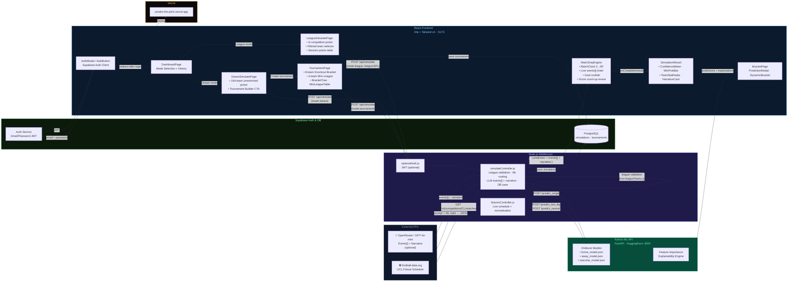

# Predict the Pitch

A high-performance football prediction engine utilizing Extreme Gradient Boosting to calculate Expected Goals (xG) and match probabilities across European competitions.

* [Live Application](https://predict-the-pitch.vercel.app/)
* [Model Training & Data Pipeline (Google Colab)](https://colab.research.google.com/drive/196y-nJi2nGKwuWfoKYxCHYP_WlZRwnEq?usp=sharing)

## Project Overview

Predicting football matches is inherently chaotic. This project solves the problem of conflicting statistical models by deploying a hierarchical machine learning system that understands team form, goal difference, and win rates, rather than relying on static team names. 

The engine specifically supports complex tournament structures, seamlessly handling formats like two-legged Champions League ties and neutral-venue finals.

## Machine Learning Architecture

The system relies on a dual-model approach to generate robust, logically consistent predictions.

### Expected Goals (xG) Engine
The first layer consists of two independent XGBoost Regressors. These models are trained specifically to calculate the exact number of goals the home and away teams are mathematically expected to score based on historical offensive and defensive power.

### Probability Engine
The second layer acts as a reality check. A separate XGBoost Classifier ignores the scorelines entirely and focuses strictly on calculating the precise percentage chance of a Home Win, a Draw, or an Away Win.

### Hierarchy Enforcement Algorithm
In statistical modeling, regressors and classifiers occasionally disagree. If the Regressors predict a 1-1 draw based on expected goals, but the Classifier highly favors the away team with a 60 percent win probability, a custom Python algorithm intervenes. The system treats the Classifier as the ultimate authority, forcing the final goal prediction to logically align with the highest probability outcome. This ensures that every prediction presented to the user is mathematically sound.

### Accuracy
Through rigorous backtesting on hidden data, this XGBoost architecture consistently achieves a Win/Draw/Loss accuracy of over 55.55 percent. This places the engine squarely in the same performance tier as professional sports analytics and sports betting models.

## The Tech Stack

* Frontend: React, Tailwind CSS, Vercel
* Backend API: FastAPI, Uvicorn, Python
* Machine Learning: XGBoost, Pandas, Scikit-learn, Numpy

## Installation and Local Setup

To run Predict the Pitch locally, you will need to start both the Python backend and the React frontend.

1. Clone the repository and navigate into the project folder:
```bash
git clone https://github.com/yourusername/predict-the-pitch.git
cd predict-the-pitch
```

2. Start the Backend API:
Navigate into the API directory, install dependencies, and run the server.
```bash
cd api_FOR_ai_match_predictor
pip install -r requirements.txt
uvicorn main:app --reload
```
The FastAPI backend will now be running on `http://localhost:8000`.

3. Start the Frontend Client:
Open a new terminal window, return to the project root, install Node dependencies, and start React.
```bash
cd predict-the-pitch
npm install
npm run dev
```
The application will now be running on `http://localhost:5173`.

## System Architecture (v4)

The diagram below illustrates the full v4 data flow: Supabase Auth gate → Dashboard mode selection → League or Dream routing → Match Day Engine animation → Result reveal.



### Data Flow Summary (v4)

| Step | Source → Destination | Protocol | Auth Required |
|------|---------------------|----------|---------------|
| 1 | User → Supabase Auth | HTTPS / JWT | — |
| 2 | Auth → Dashboard → Mode Selection | React Router | ✅ Required |
| 3 | football-data.org → Node.js Middleware | REST GET | No |
| 4 | League/Dream/Tournament page → `/api/simulate` | REST POST + optional JWT | Optional |
| 5 | Node.js: League validation against `leagueTeams.js` | In-process | — |
| 6 | Node.js → Python FastAPI `/predict_single` | REST POST | No |
| 7 | Node.js → OpenRouter GPT-4o-mini | REST POST | API Key |
| 8 | LLM → structured `events[]` JSON + `narrative` | JSON response | — |
| 9 | MatchDayEngine animates events 0→90' | Frontend | — |
| 10 | Node.js → Supabase DB (simulations + tournaments) | PostgreSQL | Service Role |
| 11 | React Frontend → Vercel CDN | Static deploy | — |
